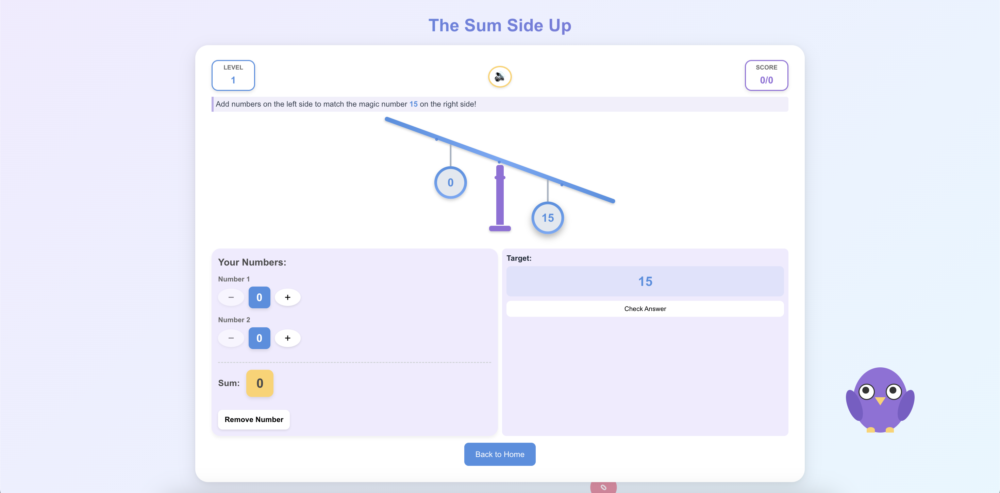
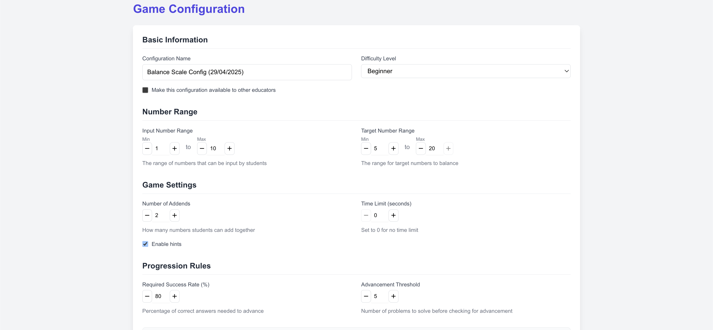
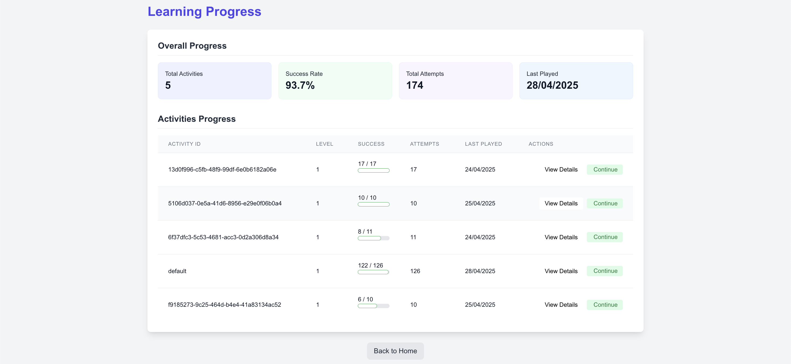

# Balance Scale Addition Game

## Overview

The Balance Scale Addition Game is an interactive educational tool designed to teach addition concepts through visual intuition. Students interact with a virtual balance scale where they need to find numbers that add up to match a target value displayed on one side of the scale. The scale provides immediate visual feedback by tilting to indicate if the sum is too large or too small, making abstract mathematical concepts concrete and tangible.

## Educational Approach

### Game Mechanics and Learning

The Balance Scale Addition Game leverages several key educational principles:

#### Visual-Spatial Learning
The game transforms abstract numerical relationships into concrete visual representations. By using a balance scale as the central metaphor, students can:
- See the relationship between numbers
- Understand equality and inequality through physical balance
- Develop intuition about numeric relationships before formal algorithms

#### Immediate Feedback
Learning is accelerated through:
- Real-time visual feedback (scale tilting)
- Color-coded indicators for correct/incorrect answers
- Sound effects that reinforce understanding
- Encouraging messages that promote growth mindset

#### Adaptive Difficulty
The game meets students where they are and grows with them:
- Starts with simple addition problems using small numbers
- Gradually increases complexity based on performance
- Introduces additional addends as students master basic concepts
- Adjusts target number ranges to challenge developing skills

#### Differentiated Learning Paths
Support for diverse learning needs:
- Optional time limits for students who need pacing challenges
- Configurable hint systems for those who need additional support
- Multiple input methods (keyboard, buttons) for accessibility
- Progress tracking to identify areas needing reinforcement

### Pedagogical Foundation

This game was designed with these core educational principles:

1. **Concrete to Abstract**: Starting with visual models before moving to symbolic math
2. **Active Learning**: Students experiment and discover patterns rather than following procedures
3. **Growth Mindset**: Feedback focused on effort and improvement, not just right/wrong
4. **Personalization**: Customizable difficulty adapts to individual learning needs
5. **Metacognition**: Students can visualize their thinking and reflect on their strategies

### Alignment with Educational Standards

The game supports these common mathematical practices and standards:
- Making sense of problems and persevering in solving them
- Reasoning abstractly and quantitatively
- Looking for and making use of structure
- Developing number sense and fluency with addition

## Live Demo

The Balance Scale Addition Game is live and fully functional! Experience the game yourself at:

**[https://the-sum-side-up.vercel.app/](https://the-sum-side-up.vercel.app/)**

### Key Screens

*The main game interface showing the balance scale, target number, and input fields*

*The activity builder interface for creating custom game configurations*

*User progress tracking with performance statistics*

### Responsive Design

The game is fully responsive and works seamlessly on:
- Desktop computers
- Tablets
- Mobile phones

This ensures accessibility in various educational settings, from computer labs to personal devices at home.

## Features

### Core Game Experience
- **Interactive Balance Scale**: A visually engaging scale that responds to user inputs with realistic tilting animations
- **Target Number Generation**: Dynamically generated target numbers based on difficulty level
- **Multiple Input Fields**: Support for 2-5 addends, adjustable based on difficulty
- **Immediate Visual Feedback**: The scale tilts to indicate if values are too high or too low
- **Sound Effects**: Audio feedback for correct/incorrect answers and game events
- **Progression System**: Gradually increasing difficulty based on player performance
- **Time Challenges**: Optional time limits to encourage quick thinking
- **Hints System**: Configurable hint availability to support learners

### User Management
- **Authentication**: Email/password and Google sign-in options via Firebase
- **Progress Tracking**: User activity and performance statistics
- **Session Management**: Secure user sessions with protected routes

### Activity Builder
- **Customizable Configurations**: Create and save custom game settings
- **Difficulty Settings**: Adjust target ranges and number of addends
- **Time Limits**: Optional countdown timer settings
- **Preview Functionality**: Test configurations before saving
- **Sharable Activities**: Activities can be made public for other users

### Technical Features
- **Responsive Design**: Works on desktops, tablets, and mobile devices
- **Offline Support**: Core game functionality works without internet
- **Accessibility**: Screen reader support and keyboard navigation
- **Error Handling**: Robust error handling for API calls and game logic

## Getting Started

The Balance Scale Addition Game is deployed and ready to use on Vercel.

### Accessing the Application

You can access the live application at: [https://the-sum-side-up.vercel.app/](https://the-sum-side-up.vercel.app/)

### User Accounts

* **Demo Account**: If you'd like to explore without creating an account, you can use the demo credentials:
  * Email: `demo@example.com`
  * Password: `demo123`

* **Create Your Own**: You can also create your own account using email/password or Google sign-in.

### Getting the Most Out of the Game

1. **Start With Default Game**: New users can immediately start playing with the default game configuration
2. **Create Custom Games**: Educators can create and save custom game configurations
3. **Track Progress**: Sign in to track your progress and see improvement over time
4. **Share Activities**: Create and share educational activities with other users

### Requirements

* Modern web browser (Chrome, Firefox, Safari, Edge)
* Internet connection for authentication and progress tracking
* Audio enabled for sound effects (optional)
* Mobile or desktop device (fully responsive design)

## Architecture

### Frontend (Vue.js)
- **Framework**: Vue 3 with Composition API
- **State Management**: Pinia for game state and user data
- **Routing**: Vue Router with authentication guards
- **Styling**: Tailwind CSS for responsive design
- **Sound**: Howler.js for sound management
- **Data Storage**: Firebase Firestore
- **Authentication**: Firebase Authentication

### Backend (FastAPI)
- **API Framework**: FastAPI
- **Data Validation**: Pydantic models
- **Authentication**: JWT with Firebase token validation
- **Testing**: Comprehensive test suite with pytest

### Data Flow
1. User authenticates via Firebase
2. Game configurations and user progress are stored in Firestore
3. Game state is managed locally in Pinia store
4. User interactions trigger state updates, visual changes, and API calls
5. Progress is tracked and saved automatically

## Components

### Core Components
- **BalanceScale**: Visualizes the relationship between target and user inputs
- **NumberInput**: Custom input component for entering addends
- **GameView**: Main game interface with controls and feedback
- **ConfigView**: Activity builder interface for educators

### Services
- **GameStore**: Manages game state and logic
- **AuthStore**: Handles user authentication and session
- **SoundService**: Manages sound effects and muting
- **ConfigService**: Saves and loads game configurations
- **ProgressService**: Tracks and retrieves user progress

## How to Play

1. **Start a Game**: Click the "Start Game" button on the game screen
2. **Balance the Scale**: Enter numbers in the input fields that add up to the target value
3. **Check Your Answer**: Click "Check Answer" to see if your solution is correct
4. **Progress**: Successfully complete problems to advance to higher levels
5. **Customize**: Create custom activities in the Activity Builder to focus on specific skills

## Activity Builder Guide

Educators can create custom activities with specific learning goals:

1. **Create New**: Click "Create New Activity" in the Configuration view
2. **Set Parameters**:
   - Title and description
   - Difficulty level
   - Target number range
   - Number of addends
   - Time limit (optional)
   - Hint availability
3. **Preview**: Test your activity before saving
4. **Save & Share**: Save your activity and choose to make it public

## Key Components in Detail

### Game Components

#### Balance Scale (BalanceScale.vue)
A visually dynamic component that represents a physical balance scale. It:
- Visualizes weight differences through tilting animations
- Provides immediate feedback on whether the input matches the target
- Uses CSS transformations for smooth physics-based animations
- Includes accessibility features for screen readers

#### Number Input (NumberInput.vue)
A specialized input component that:
- Restricts input to valid numerical values
- Provides increment/decrement buttons
- Shows validation feedback
- Supports keyboard navigation and screen readers

### Game Logic

#### Game Store (gameStore.ts)
The central state management for game mechanics:
- Manages game configuration (difficulty, addends, time limits)
- Tracks game state (attempts, successes, current level)
- Handles target number generation
- Implements game progression logic
- Provides computed properties for derived game state
- Validates user answers and tracks balance state

#### Sound Service (soundService.ts)
Manages all audio aspects of the game:
- Loads and caches sound effects using Howler.js
- Handles playback errors gracefully with fallbacks
- Supports muting/unmuting functionality
- Ensures sounds work across different browsers

### User Progress Tracking

#### Progress Service (progressService.ts)
Tracks and persists user progress:
- Records individual game attempts
- Calculates success rates and progression metrics
- Supports retrieving historical performance data
- Synchronizes data with Firebase Firestore

### Authentication

#### Auth Store (authStore.ts)
Manages user authentication state:
- Handles login, registration, and logout
- Stores user profile information
- Provides authentication state to protected routes
- Integrates with Firebase Authentication

### Getting Help

If you encounter issues not covered in this documentation:

1. Check the browser console for error messages
2. Review the backend logs for API errors
3. File an issue on the GitHub repository with:
   - Steps to reproduce the problem
   - Expected vs. actual behavior
   - Browser/device information
   - Screenshots if applicable

## Contributing

We welcome contributions to improve the Balance Scale Addition Game:

1. Fork the repository
2. Create a feature branch (`git checkout -b feature/amazing-feature`)
3. Commit your changes (`git commit -m 'Add some amazing feature'`)
4. Push to the branch (`git push origin feature/amazing-feature`)
5. Open a Pull Request

## Licensing

This project is licensed under the Apache License 2.0 - see the LICENSE file for details.

## Acknowledgments

- This project was created as part of the Comini Learning hiring challenge
- Special thanks to all contributors who helped make this educational tool a reality 